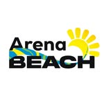

# 🎾 ArenaBeach - Agendamento de Quadras
ArenaBeach é uma aplicação web moderna para o agendamento e gerenciamento de quadras de beach tennis. O projeto foi desenvolvido com foco em uma experiência de usuário (UX) limpa, rápida e intuitiva, permitindo que os jogadores reservem horários, gerenciem suas aulas e acessem as gravações de seus jogos de forma simplificada.

<div align="center">



</div>

---

# ✨ Funcionalidades Principais
- **Dashboard (Tela Inicial):** Saudações personalizadas, exibição da data atual, atalho para a próxima reserva e um "hub" de acesso rápido.

- **Agendamento de Quadras:**

    - Seleção de data em um carrossel dinâmico que gera os próximos 7 dias.
    - Filtro entre quadras Cobertas e Descobertas.
    - Visualização clara de horários por status: Disponível, Reservado, Aula ou Minha Reserva.

- **Fluxo de Reserva (Multi-etapa):**

    - Modal de confirmação detalhado (quadra, data, horário).
    - Opção de adicionar "Gravação do Jogo" como um serviço extra.

- **Fluxo de Pagamento:**

    - Seleção de método de pagamento (PIX ou Cartão de Crédito).
    - Formulário de cartão de crédito.

- **Seções de Conteúdo:**

    - **Aulas:** Visualização de instrutores disponíveis para agendamento.
    - **Meus Vídeos:** Galeria para acessar as gravações dos jogos.
    - **FAQ e Contato:** Seções na tela inicial para sanar dúvidas e facilitar o contato (WhatsApp/Email).

- **Design Responsivo:**

    - Navegação principal otimizada para Desktop (menu no Header).
    - Navegação principal otimizada para Mobile (menu na BottomTabBar).

---

# 🚀 Tecnologias Utilizadas
- **Frontend**: React 18+
- **Bundler**: Vite
- **Roteamento**: React Router DOM (v6)
- **Estilização**: CSS puro com classes semânticas e arquitetura BEM-like (sem frameworks CSS).
- **Linguagem**: JavaScript (JSX)
- **Ícones**: Emojis (para simplicidade e leveza)

---

# 📁 Estrutura de Pastas
O projeto é organizado com uma arquitetura clara de componentes e páginas para facilitar a manutenção:

- Front End:
```Bash
src/
├── assets/         # Imagens, fontes e outros arquivos estáticos (ex: logo)
├── components/     # Componentes reutilizáveis (Header, TimeSlot, Modais, etc.)
├── pages/          # Componentes de tela (Inicio, Agendamento, Aulas, etc.)
├── Global.css      # Arquivo único de estilização de todo o app
├── Layout.jsx      # Componente "pai" que renderiza o header, footer e rotas filhas
├── main.jsx        # Ponto de entrada principal da aplicação
└── Router.jsx      # Define todas as rotas da aplicação
```
---

# ⚙️ Como Executar o Projeto Localmente

Para rodar este projeto em sua máquina local, siga os passos abaixo:

#### 1. Clone o repositório:

```Bash
git clone https://github.com/JoaoPedro2206/ArenaBeach
cd arena-beach
```

#### 2. Instale as dependências: O projeto usa react-router-dom além das dependências padrão do Vite.

```Bash
npm install
```

#### 3. Execute o servidor de desenvolvimento:
```Bash
npm run dev
```

#### 4. Abra no navegador: O terminal indicará o endereço local, geralmente `http://localhost:5173/`.

---

# 📈 Melhorias Futuras
Este projeto é um protótipo de frontend. Os próximos passos para torná-lo uma aplicação completa incluiriam:

- [ ] Integração com Back-end: Conectar a uma API (Node.js, Firebase, etc.) para persistir os agendamentos e dados de usuários.

- [ ] Autenticação: Criar um sistema de Login/Cadastro para personalizar a experiência.

- [ ] "Minhas Reservas": Implementar uma tela onde o usuário possa ver e cancelar seus agendamentos.

- [ ] Pagamento Real: Integrar com um gateway de pagamento (Stripe, Mercado Pago).